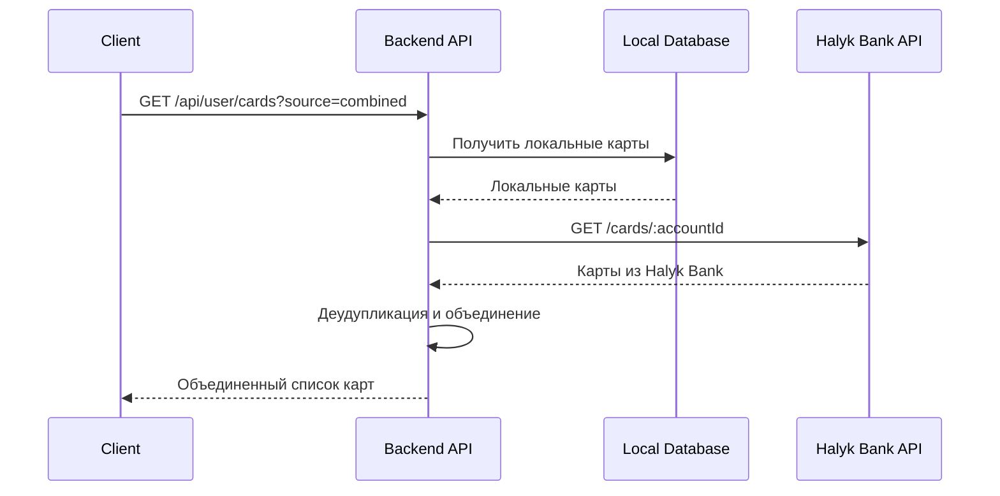

# 🏦 API получения сохраненных карт из Halyk Bank

## 📋 Описание

Реализация API для получения списка сохраненных карт согласно документации Halyk Bank: https://epayment.kz/docs/poluchenie-spiska-kart

## 🎯 Новые API методы

### 1. Получение карт из Halyk Bank API

**Endpoint:** `GET /api/payments/saved-cards/:accountId`

**Описание:** Прямое получение списка сохраненных карт из API Halyk Bank

**Заголовки:**
```
Authorization: Bearer YOUR_JWT_TOKEN
```

**Параметры:**
- `accountId` (string) - ID аккаунта пользователя (обычно user_id)

**Ответ:**
```json
{
  "success": true,
  "data": {
    "cards": [
      {
        "halyk_id": "6845e5d5-35cc-428e-bd95-e85f78cb59d1",
        "transaction_id": "a4b8c500-ddbf-4475-b512-60cd5a9189f7",
        "merchant_id": "1a8ca610-73eb-4996-a2ef-5ec1d57bf573",
        "card_hash": "ac2d26319b1910692db0e357e88a3d02cd9e7867d72e6d2c6f4f48e61a46201e",
        "card_mask": "4405...2283",
        "payer_name": "TEST",
        "reference": "034680043232",
        "int_reference": "005224F86969006E",
        "token": "A5011A20B136418774169BC24030C63B",
        "terminal": "98458031",
        "created_date": "2020-12-11T15:47:58.828909+06:00",
        "payment_available": false,
        "account_id": "testuser1"
      }
    ],
    "total": 1,
    "source": "halyk_api",
    "account_id": "252"
  },
  "message": "Найдено 1 сохраненных карт в Halyk Bank"
}
```

**Если карты не найдены:**
```json
{
  "success": true,
  "data": {
    "cards": [],
    "total": 0,
    "source": "halyk_api"
  },
  "message": "Сохраненные карты не найдены"
}
```

---

### 2. Получение объединенного списка карт

**Endpoint:** `GET /api/payments/saved-cards-combined`

**Описание:** Получение объединенного списка карт из локальной БД и Halyk Bank API с деудупликацией

**Заголовки:**
```
Authorization: Bearer YOUR_JWT_TOKEN
```

**Ответ:**
```json
{
  "success": true,
  "data": {
    "cards": [
      {
        "card_id": 45,
        "halyk_id": "6845e5d5-35cc-428e-bd95-e85f78cb59d1",
        "card_mask": "4405...2283",
        "payer_name": "TEST",
        "created_date": "2020-12-11T15:47:58.828909+06:00",
        "payment_available": false,
        "source": "halyk_api",
        "local_record": true
      },
      {
        "card_id": 46,
        "halyk_id": "old-card-id-123",
        "card_mask": "**** **** **** 1234",
        "payer_name": null,
        "created_date": null,
        "payment_available": null,
        "source": "local_db",
        "local_record": true
      }
    ],
    "total": 2,
    "sources": {
      "halyk_api": 1,
      "local_db": 2,
      "combined": 2
    }
  },
  "message": "Найдено 2 сохраненных карт (1 из Halyk API + 2 локальных)"
}
```

---

### 3. Обновленный API пользователя

**Endpoint:** `GET /api/user/cards`

**Описание:** Расширенный API получения карт с поддержкой разных источников данных

**Заголовки:**
```
Authorization: Bearer YOUR_JWT_TOKEN
```

**Query параметры:**
- `source` (string, optional) - Источник данных:
  - `local` - только локальная БД (по умолчанию оригинальное поведение)
  - `halyk` - только Halyk Bank API
  - `combined` - объединенные данные (по умолчанию)

**Примеры запросов:**
```
GET /api/user/cards?source=local     # Только локальная БД
GET /api/user/cards?source=halyk     # Только Halyk Bank API  
GET /api/user/cards?source=combined  # Объединенные данные (по умолчанию)
GET /api/user/cards                  # Объединенные данные (по умолчанию)
```

---

## 🔧 Техническая реализация

### Интеграция с Halyk Bank API

Согласно документации https://epayment.kz/docs/poluchenie-spiska-kart:

**URL TEST:** `GET https://testepay.homebank.kz/api/cards/:accountId`
**URL PROD:** `GET https://epay-api.homebank.kz/cards/:accountId`

**Headers:**
```
Authorization: Bearer {access_token}
```

**Получение токена:**
Используется существующий метод `PaymentController.getHalykToken()` с параметрами:
- amount: '0'
- currency: 'KZT' 
- scope: включает доступ к API карт

### Обработка ошибок

**Код 1373 - Записи не найдены:**
```json
{
  "code": 1373,
  "message": "Запись не найдена!"
}
```

**Другие ошибки:**
```json
{
  "code": 100,
  "message": "Описание ошибки"
}
```

### Деудупликация карт

При объединении данных:
1. **Приоритет Halyk Bank API** - считаем актуальным источником
2. **Сопоставление по halyk_card_id** - ключ для деудупликации
3. **Дополнение локальными картами** - добавляем карты, которых нет в API

---

## 🧪 Тестирование

### Тестовая страница

Создана тестовая страница `test-halyk-cards-api.html` для проверки всех методов:

1. **Авторизация** - загрузка JWT токена
2. **Тестирование источников** - локальная БД, Halyk API, объединенные данные
3. **Визуализация результатов** - отображение карт с детальной информацией
4. **Статистика** - количество карт по источникам

### Использование

1. Откройте `test-halyk-cards-api.html`
2. Загрузите JWT токен (кнопка "Загрузить из хранилища" или введите вручную)
3. Протестируйте различные источники данных
4. Изучите результаты и статистику

---

## 🔄 Процесс работы



---

## 📊 Структуры данных

### Карта из Halyk Bank API
```typescript
interface HalykCard {
  ID: string;                    // "6845e5d5-35cc-428e-bd95-e85f78cb59d1"
  TransactionId: string;         // "a4b8c500-ddbf-4475-b512-60cd5a9189f7"  
  MerchantID: string;           // "1a8ca610-73eb-4996-a2ef-5ec1d57bf573"
  CardHash: string;             // "ac2d26319b1910692db0e357e88a3d02cd9e7867d72e6d2c6f4f48e61a46201e"
  CardMask: string;             // "4405...2283"
  PayerName: string;            // "TEST"
  Reference: string;            // "034680043232"
  IntReference: string;         // "005224F86969006E"  
  Token: string;                // "A5011A20B136418774169BC24030C63B"
  Terminal: string;             // "98458031"
  CreatedDate: string;          // "2020-12-11T15:47:58.828909+06:00"
  PaymentAvailable: boolean;    // false
  AccountID: string;            // "testuser1"
}
```

### Объединенная карта
```typescript
interface CombinedCard {
  card_id?: number;             // ID в локальной БД (может отсутствовать)
  halyk_id: string;             // ID в Halyk Bank
  card_mask: string;            // Маска карты
  payer_name?: string;          // Имя владельца (из Halyk API)
  created_date?: string;        // Дата создания (из Halyk API) 
  payment_available?: boolean;  // Доступность для оплаты (из Halyk API)
  source: 'halyk_api' | 'local_db' | 'combined';
  local_record: boolean;        // Есть ли запись в локальной БД
}
```

---

## ✅ Готово к использованию!

Новые API методы полностью интегрированы и готовы к использованию:

- ✅ Прямое получение карт из Halyk Bank API
- ✅ Объединение данных с локальной БД
- ✅ Деудупликация и приоритизация
- ✅ Обработка всех сценариев ошибок
- ✅ Полная документация с примерами
- ✅ Тестовая страница для проверки
- ✅ Типизация TypeScript

**Следующие шаги:**
1. Протестируйте API используя `test-halyk-cards-api.html`
2. Интегрируйте в ваш фронтенд
3. Обновите существующие вызовы API для использования новых источников данных
