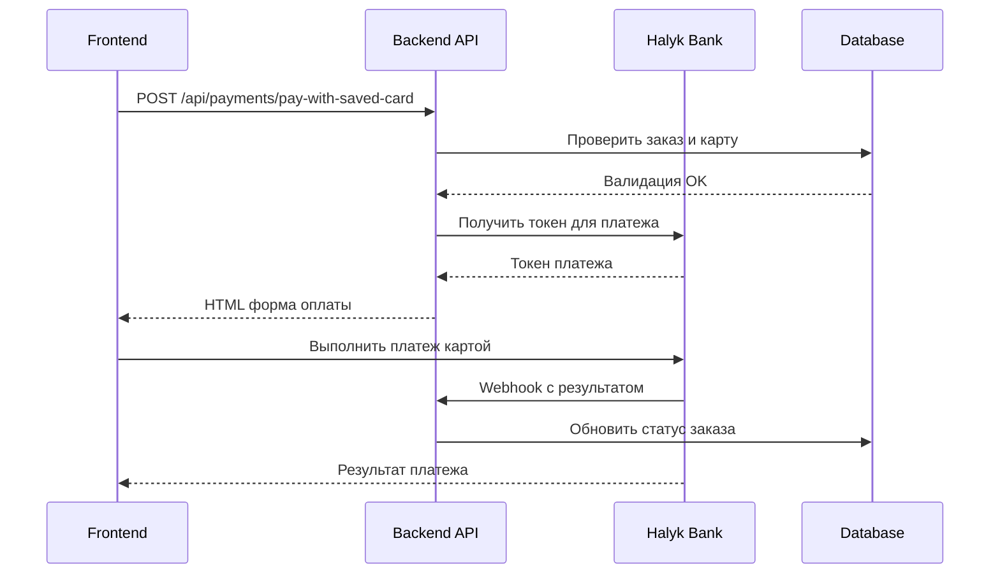

# API оплаты сохраненными картами

## Обзор
API для оплаты существующих заказов с использованием ранее сохраненных карт пользователя.

## Эндпоинт

### POST `/api/payments/pay-with-saved-card`
Оплата заказа сохраненной картой

#### Аутентификация
- Требуется: JWT токен в заголовке Authorization

#### Параметры запроса
```json
{
  "order_id": 123,        // ID заказа для оплаты
  "saved_card_id": 45     // ID сохраненной карты
}
```

#### Валидация
1. **Проверка заказа:**
   - Заказ должен существовать
   - Заказ должен принадлежать текущему пользователю
   - Заказ не должен быть уже оплачен

2. **Проверка карты:**
   - Карта должна существовать
   - Карта должна принадлежать текущему пользователю

#### Ответ
Возвращает HTML страницу с формой оплаты Halyk Bank

```html
<!DOCTYPE html>
<html>
<head>
    <title>Оплата заказа</title>
</head>
<body>
    <div class="payment-form">
        <h2>Оплата заказа сохраненной картой</h2>
        <p><strong>Номер заказа:</strong> ORD-20241227-123456-567890</p>
        <p><strong>Сумма к оплате:</strong> 2500 ₸</p>
        <p><strong>Карта:</strong> **** **** **** 1234</p>
        
        <form name="halyk">
            <input type="hidden" name="pg_order_id" value="ORD-20241227-123456-567890">
            <input type="hidden" name="pg_merchant_id" value="NALIV.KZ">
            <input type="hidden" name="pg_amount" value="2500">
            <input type="hidden" name="pg_currency" value="KZT">
            <input type="hidden" name="pg_description" value="Оплата заказа #123">
            <input type="hidden" name="pg_card_id" value="12345">
            <input type="hidden" name="pg_sig" value="...">
            <input type="hidden" name="pg_payment_route" value="frame">
            
            <button type="submit" onclick="payWithSavedCard()">
                Оплатить 2500 ₸
            </button>
        </form>
    </div>

    <script>
        function payWithSavedCard() {
            halyk.pay();
        }
        
        // Обработка результатов платежа
        function onPaymentSuccess(result) {
            if (window.opener) {
                window.opener.postMessage({
                    type: 'payment_success',
                    invoiceId: result.pg_order_id
                }, '*');
            }
            window.close();
        }
        
        function onPaymentFailure(result) {
            if (window.opener) {
                window.opener.postMessage({
                    type: 'payment_failure',
                    error: result.pg_error_description
                }, '*');
            }
            window.close();
        }
    </script>
    
    <script src="https://api.paybox.money/payment/widget/js/paybox_widget.js"></script>
</body>
</html>
```

#### Коды ошибок

##### 404 - Order not found
```json
{
  "success": false,
  "error": {
    "message": "Заказ не найден",
    "statusCode": 404,
    "timestamp": "2024-12-27T12:00:00.000Z"
  }
}
```

##### 403 - Access denied
```json
{
  "success": false,
  "error": {
    "message": "Доступ запрещен. Заказ принадлежит другому пользователю",
    "statusCode": 403,
    "timestamp": "2024-12-27T12:00:00.000Z"
  }
}
```

##### 400 - Order already paid
```json
{
  "success": false,
  "error": {
    "message": "Заказ уже оплачен",
    "statusCode": 400,
    "timestamp": "2024-12-27T12:00:00.000Z"
  }
}
```

##### 404 - Card not found
```json
{
  "success": false,
  "error": {
    "message": "Сохраненная карта не найдена",
    "statusCode": 404,
    "timestamp": "2024-12-27T12:00:00.000Z"
  }
}
```

##### 403 - Card access denied
```json
{
  "success": false,
  "error": {
    "message": "Доступ запрещен. Карта принадлежит другому пользователю",
    "statusCode": 403,
    "timestamp": "2024-12-27T12:00:00.000Z"
  }
}
```

## Интеграция с фронтендом

### Получение списка сохраненных карт
```javascript
const response = await fetch('/api/user/cards', {
    headers: {
        'Authorization': `Bearer ${token}`
    }
});
const cards = await response.json();
```

### Получение неоплаченных заказов
```javascript
const response = await fetch(`/api/orders/user/${userId}`, {
    headers: {
        'Authorization': `Bearer ${token}`
    }
});
const orders = await response.json();

// Фильтруем неоплаченные
const unpaidOrders = orders.data.orders.filter(order => 
    order.status?.status === 66 || order.status?.status === 0
);
```

### Оплата заказа сохраненной картой
```javascript
const response = await fetch('/api/payments/pay-with-saved-card', {
    method: 'POST',
    headers: {
        'Content-Type': 'application/json',
        'Authorization': `Bearer ${token}`
    },
    body: JSON.stringify({
        order_id: 123,
        saved_card_id: 45
    })
});

// Получаем HTML и открываем в новом окне
const html = await response.text();
const paymentWindow = window.open('', '_blank');
paymentWindow.document.write(html);
```

### Обработка результатов оплаты
```javascript
// Слушаем сообщения от платежного окна
window.addEventListener('message', function(event) {
    if (event.data.type === 'payment_success') {
        console.log('Платеж успешен:', event.data.invoiceId);
        // Обновить статус заказа
    } else if (event.data.type === 'payment_failure') {
        console.log('Ошибка платежа:', event.data.error);
    }
});
```

## Безопасность

1. **Аутентификация:** Все запросы требуют действительный JWT токен
2. **Авторизация:** Пользователь может оплачивать только свои заказы своими картами
3. **Валидация:** Проверка существования и доступности заказа и карты
4. **Предотвращение повторной оплаты:** Проверка статуса заказа

## Тестирование

Используйте файл `test-saved-card-payment.html` для тестирования функциональности:

1. Загрузите свои сохраненные карты
2. Получите список неоплаченных заказов
3. Выберите заказ и карту
4. Выполните оплату
5. Проверьте статус платежа

## Связанные API

- `GET /api/user/cards` - Получение сохраненных карт
- `GET /api/orders/user/:userId` - Получение заказов пользователя
- `GET /api/payments/order-payment-status/:orderId` - Проверка статуса оплаты
- `POST /api/payments/webhook` - Webhook для обработки результатов
- `GET /api/payments/success` - Страница успешной оплаты
- `GET /api/payments/failure` - Страница неудачной оплаты

## Процесс оплаты


